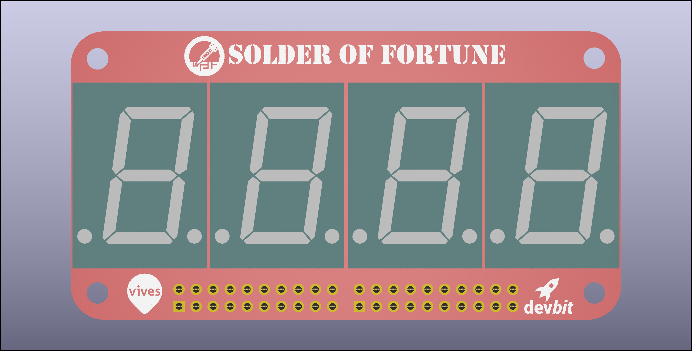
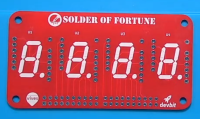
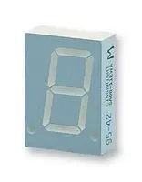
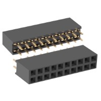
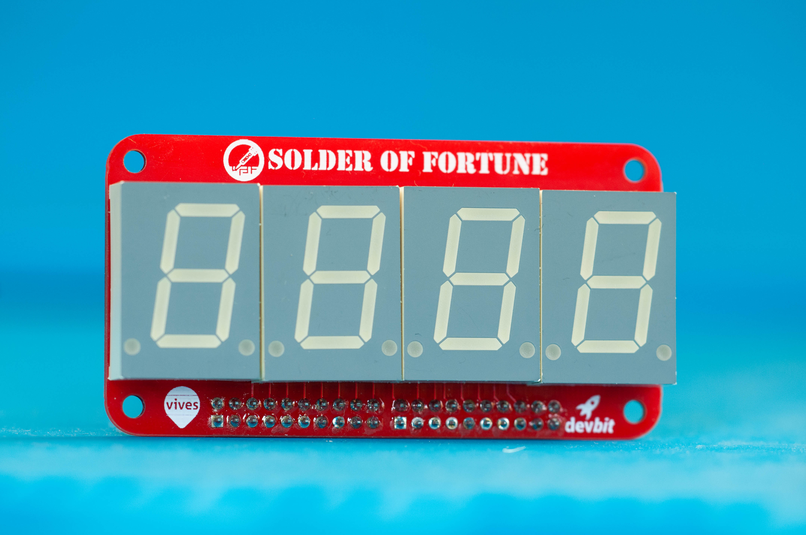

# 7 Segment Challenge

The first challenge does not yet contain any SMT components. It just a challenge to get you comfortable with a soldering iron. It contains only parts that have (through hole) leads that need to be pushed through the PCB and be soldered on the other side.

The goal is to solder 4 7-Segment displays onto the PCB. In order to connect different boards to the displays, 2 20pin female header need to be soldered at the bottom.

## Parts

| Image | Part | Quantity | Product |
|---|---|---|---|
|  | 7 Segment PCB | 1 | [schematic](/files/7-segment.pdf) |
|  | 7 Segment displays | 4 | [SA08-11EWA](http://www.farnell.com/datasheets/2047499.pdf) |
|  | 2x10 female pin header | 2 | [2214S-20SG-85](http://www.farnell.com/datasheets/3148602.pdf) |

## Tools

* Soldering iron
* Soldering wire
* Tweezers
* Hot air station (optional)
* Solder paste (optional)

::: tip Hot air soldering
The hot air soldering part is optional. If you don't have any hot air station around, you can still assemble this part of the PCB the exact same way as part 1, with a soldering iron.
:::

## How to

1. Soldering the pin headers
2. Soldering the 7 segment displays

### 7 Segment displays

<YoutubeVideo videoId="QJov5SxDjRU" startAt="916" />

First you need to solder the 4 7-segment displays. This is easy. The displays have a unique footprint that misses some pins. This makes the footprint of the 7-segments direction dependent. Meaning it is impossible to position them wrong.

Start with a single 7-segment, or if possible position all 4 of them on the designated holes in the PCB. Turn the PCB around so that the segments are facing down, and the pins are facing up. Now solder 1 and only 1 pin of each of the 7-segments, it is best to choose one of pins in the corner of the component. Soldering 1 pin fixes the components to the PCB, but leaves room to make positional adjustments. Make sure to put some pressure on the PCB when soldering the first pin. This ensures the component is positioned flush on the PCB and creates a solid mount.

Turn the PCB around and check if all segments are aligned properly. If not, heat only the single soldered pin of the segment and adjusts its position with your fingers.

When everything is aligned, solder the next pin of the 7-segment. The best pin to solder next is the one diagonal on the other side of the components (The two pins that are farthest from each other). This creates the most solid fixture of the components.

Until now it is stil possible to make small adjustments to the alignment and positions. It is advised to turn your PCB around and inspect if everything is in the correct place and the components are positioned solid and flush with the PCB. Make adjustments if needed by reheating one of the already soldered pins. This creates some room to wiggle the component when the solder is fluid.

Next it is time to solder all the other pins from the 7-segment components.

### Pin headers

<YoutubeVideo videoId="QJov5SxDjRU" startAt="1392" />

Next are the pin headers. The pin headers are pretty much the same as the 7-segments. The pin headers are omnidirectional. So you insert them in any direction that fits.

One thing to take into account when soldering pin headers is that they are positioned straight. To ensure this, again use the technique of soldering only 1 pin at one of the corners. Then you can inspect if the pin headers is mounted solid and flush to the PCB. If not, heat the pin again and apply pressure on the pin header using your fingers. If enough pressure is applied in the correct direction, the component will be pressed in its ideal position. Repeat for the other pin header.

Next you can solder the corner pin diagonally opposite on the other side to ensure a solid mount. Inspect the positions again and adjust when needed.

Only if the pin headers are positioned perfectly, continue to solder all the other pins. When done, you are ready with the first challenge. Congratulations.

::: warning Make sure the pin headers are straight!
It is very important that the pin headers are straight. If they are not fitted flush with the PCB and are at an angle, it will be impossible to fit other PCB's onto it. This will render the PCB useless. Fixing this is really hard and impossible without the right tools and experience.
:::

## Tips

1. Always start with soldering a single pin
2. Apply pressure, push or pull with light pressure while reheating the single soldered pin to adjust the position
3. When the component is positioned correctly, solid and flush with the PCB, only then solder the pin in the opposite corner
4. Only solder the other pins when the component is in the perfect position

## Result

When all components are soldered on correctly. The PCB should look like this. You now have a 4 character 7-segment display!

## Documentation

* Schematic
