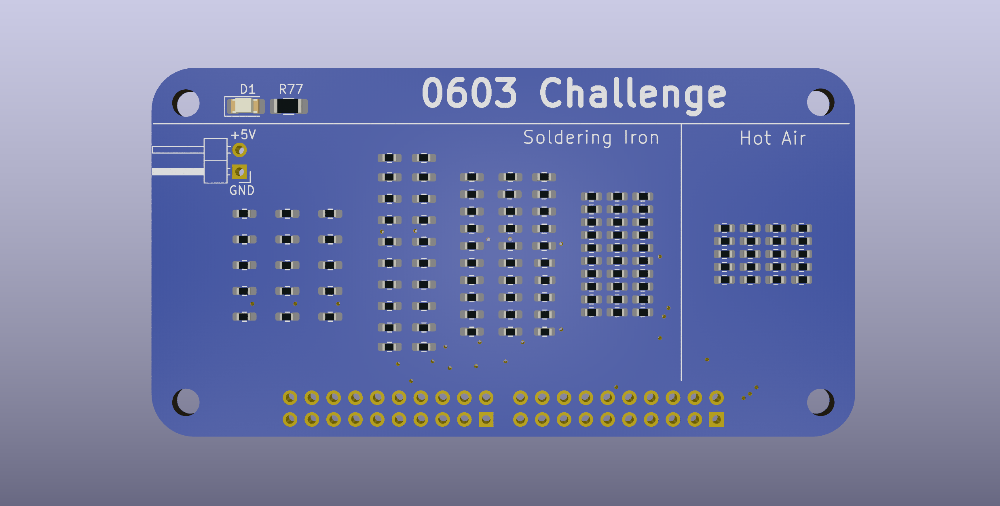
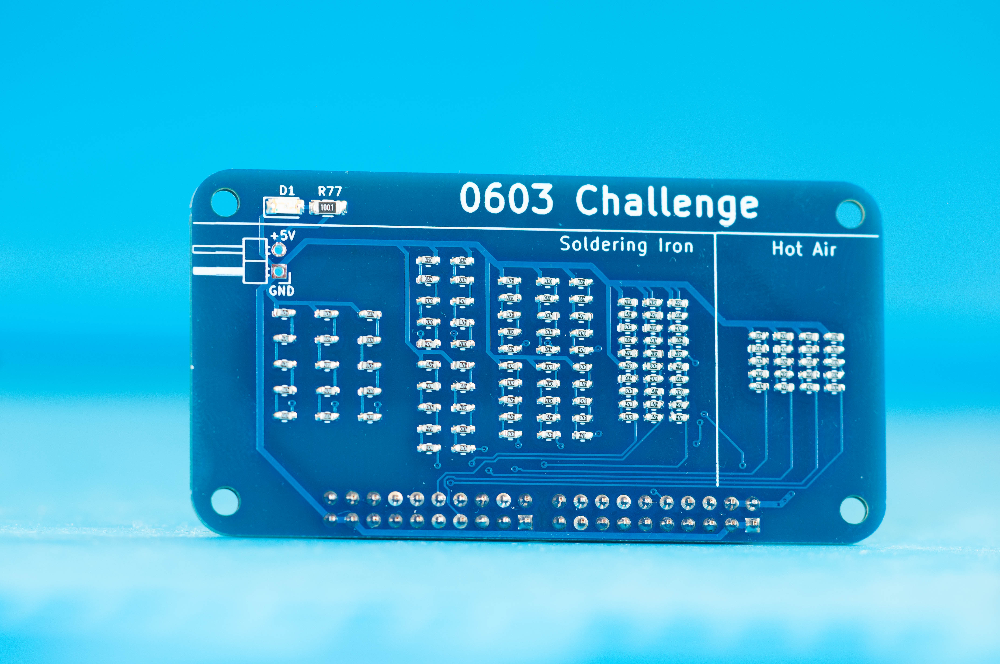
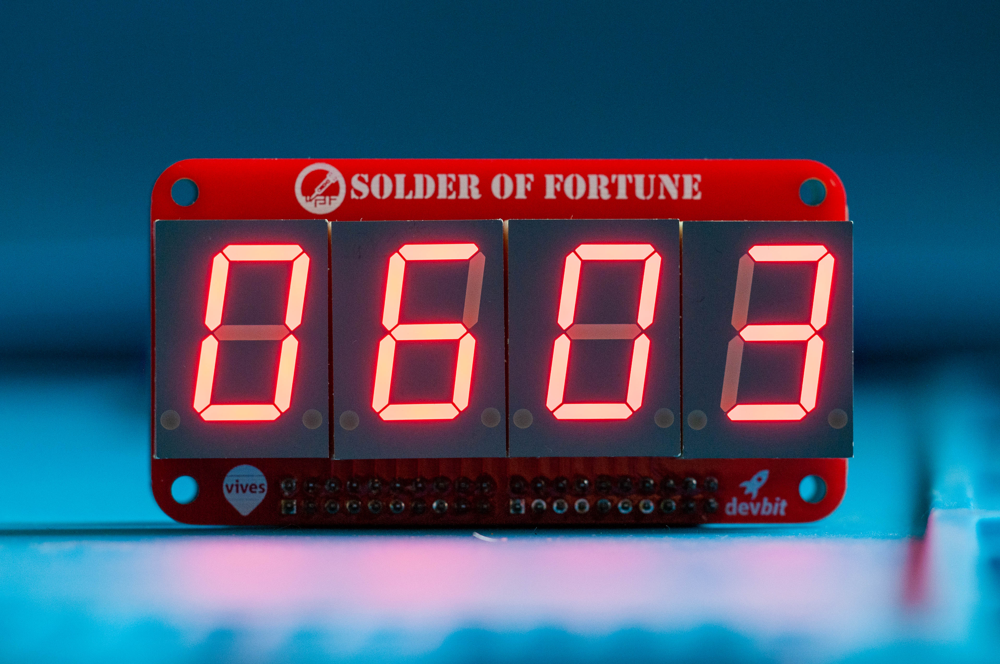

# 0603 Challenge

[Introduction]

## Parts

## How to

::: warning Make sure the pinheaders are straight!
It is very important that the pinheaders are straight. If they are not fitted flush with the PCB and are at an angle, it will be impossible to fit other PCB's onto it. This will render the PCB useless. Fixing this is really hard and impossible without the right tools and experience.
:::

## Tips

## Result

When all components are soldered on correctly. The PCB should look like this:

## Validation

